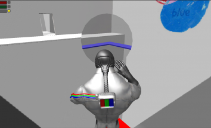
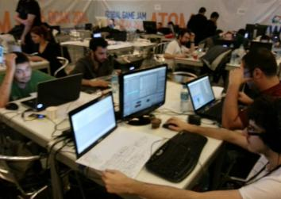

# Coloroma

Coloroma is the 3D game we developed within 48 hours during the Global Game Jam 2014 event.
The 2014 GGJ was held January 24–26 with 23,198 participants in 488 locations (72 countries). 4290 games were created.
The theme of the year was: "We don't see things as they are, we see them as we are."

  

It is free and open source. :clap: :tada:

#### Play!: https://anilbey.github.io/Coloroma/WebGL/index.html

#### Gameplay video: https://www.youtube.com/watch?v=AwEFNcBcQMk

#### GGJ website: https://globalgamejam.org/2014/games/coloroma

## Screenshot

  

## The Team

  

