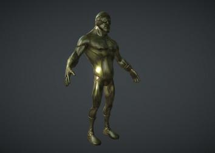

# Coloroma

Coloroma is the 3D game we developed within 48 hours during the Global Game Jam 2014 event.
The 2014 GGJ was held January 24–26 with 23,198 participants in 488 locations (72 countries). 4290 games were created.
The theme of the year was: "We don't see things as they are, we see them as we are." There are 3 different realities represented by red, green and blue colours in the game. and the player has an ability open a rift to see different realities. In this version of the game, the player is using the looking glass to observe the other realities to solve puzzles. We also started some other game scenarios including an FPS shooter but have not finished them. Perhaps this repository can serve as a basis for creating 3D first person controller style games that include interactions with unseen environments/realities/dimensions. It is up to your creativity :ghost: 

  

It is free and open source. :clap: :tada:

#### Play!: https://anilbey.github.io/Coloroma/WebGL/index.html

#### Gameplay video: https://www.youtube.com/watch?v=AwEFNcBcQMk

#### GGJ website: https://globalgamejam.org/2014/games/coloroma

## Screenshot

  

## The Team

<ul>
  <li>Mustafa Anıl Tuncel</li>
  <li>Emre Tuner</li>
  <li>Batuhan Erol</li>
  <li>Doğucan Solak</li>
  <li>Yiğit Çakar</li>
</ul>  

